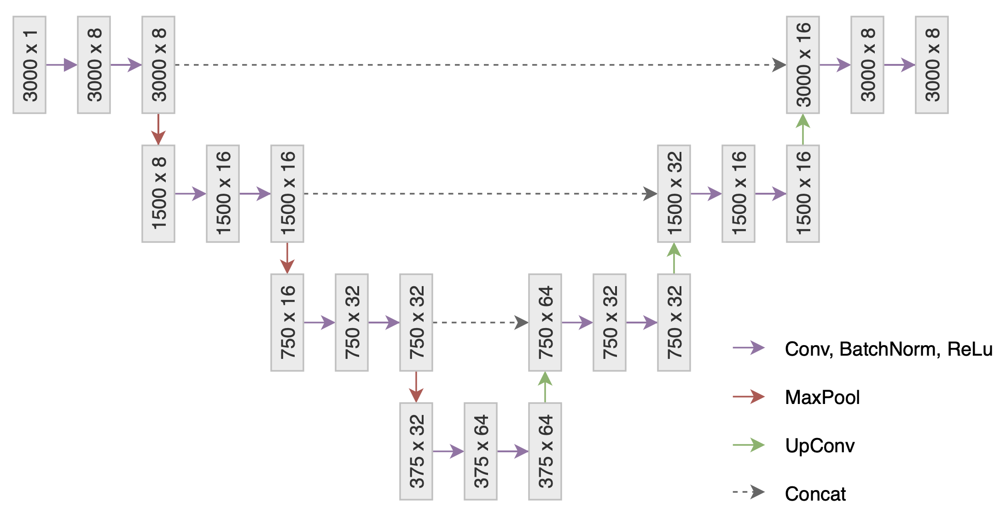
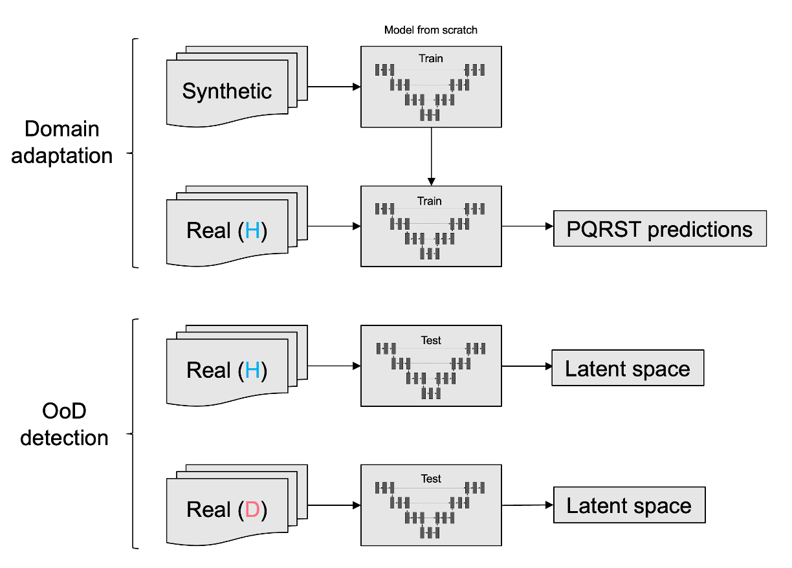

# Out-of-Distribution Detection on ECG signals via Knowledge Transfer from Synthetic Data

This project uses machine learning to automate the analysis of ECG signals and explores the possibilities of anomaly detection through out-of-distribution detection, as well as transfer learning with limited data availability.

## Functionalities

### U-Net

The network used is an adapted U-Net architecture to improve ECG pattern interpretation, specifically the detection of an ECG's P, Q, R, S and T waves.


### Synthetic Data Pretraining
Generating synthetic data using real life ECG wave metrics, and using these signals to pretrain the model to enhance performance when finetuned on the few real ECG signals available.

### Out-of-Distribution Detection
The detection of ECG anomalies is attempted using models trained exclusively on healthy data and
out-of-distribution detection to determine whether the looked-at signal shows a significant difference from a healthy one.


## Getting Started

### Prerequisites
Before running the project, ensure you have the following installed:
- Python 3.8+
- PyTorch or TensorFlow (depending on the model framework used)
- Pipenv (for managing project dependencies)

### Installation

1. Clone the repository:

   ```bash
   git clone https://github.com/urozma/out-of-distribution-detection-ecg.git
   cd out-of-distribution-detection-ecg
   ```

2. Set up the project environment using Pipenv:

   ```bash
   pipenv install
   ```

   This will create a virtual environment and install all the required dependencies for the project.
